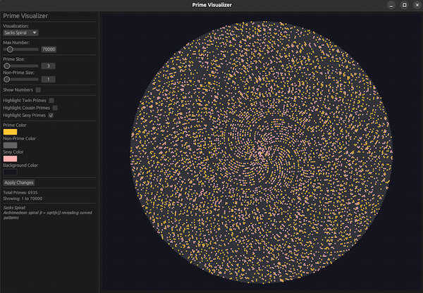

# Infinite series generators and visualizers

## Overview

This project contains infinite series generators and visualizations, including:

* An interactive visualizer for number sequences in Rust [rust-gui](./rust-gui/README.md) - supports primes, fibonacci, lucas, triangular, collatz, and powers of 2
* A high-performance parallel prime generator in Rust [rust-primes](./rust-primes/README.md), with reference implementations in Python [python-primes](./python-primes) and Go [golang-primes](./golang-primes/README.md)
* An infinite series generator in Rust [rust-series](./rust-series/README.md) - fibonacci, lucas, triangular, collatz stopping times, and powers of 2
* A fast parallelized Miller-Rabin primality tester in Rust [rust-miller-rabin](./rust-miller-rabin/README.md)




## Supported Series

| Series | Formula | Sequence |
|--------|---------|----------|
| **Primes** | Numbers divisible only by 1 and themselves | 2, 3, 5, 7, 11, 13, 17, 19, 23, 29, ... |
| **Fibonacci** | Fₙ = Fₙ₋₁ + Fₙ₋₂ | 0, 1, 1, 2, 3, 5, 8, 13, 21, 34, ... |
| **Lucas** | Lₙ = Lₙ₋₁ + Lₙ₋₂ | 2, 1, 3, 4, 7, 11, 18, 29, 47, 76, ... |
| **Triangular** | Tₙ = n(n+1)/2 | 0, 1, 3, 6, 10, 15, 21, 28, 36, 45, ... |
| **Collatz** | Steps to reach 1 via 3n+1 | 0, 0, 1, 7, 2, 5, 8, 16, 3, 19, ... |
| **Powers of 2** | 2ⁿ | 1, 2, 4, 8, 16, 32, 64, 128, 256, 512, ... |


## Implementations

All prime generators are implemented with consistent APIs and comparable algorithms

| Language | Directory | Algorithm | Parallelism |
|----------|-----------|-----------|-------------|
| Python   | [`python-primes/`](./python-primes/README.md) | Classic/Segmented/Parallel Sieve | `multiprocessing.Pool` |
| Go       | [`golang-primes/`](./golang-primes/README.md) | Classic/Segmented/Parallel Sieve | Goroutines + channels  |
| Rust     | [`rust-primes/`](./rust-primes/README.md)     | Classic/Segmented/Parallel Sieve | `thread::scope`        |


## Quick Start

### Number Sequence Visualizer (GUI)
```bash
cd rust-gui
cargo run
```

### Series Generator (CLI)
```bash
cd rust-series
cargo run -- -c 100 -s fib       # Fibonacci
cargo run -- -c 100 -s lucas     # Lucas numbers
cargo run -- -c 100 -s tri       # Triangular numbers
cargo run -- -c 100 -s collatz   # Collatz stopping times
cargo run -- -c 100 -s pow2      # Powers of 2
```

### Prime Generators (CLI and Libraries)

#### Performance Comparison (Rust vs Go vs Python)

```bash
make compare    # Run all implementations (10M primes)
make build      # Build all
make test       # Run all tests
make clean      # Clean build artifacts
```

## CLI Usage Examples

### Generate primes < 1000
```bash
cd golang-primes; ./primes 1000                         # Go
cd python-primes; python prime_generator.py 1000        # Python
cd rust-primes;   ./target/release/primes_cli -n 1000   # Rust
```

### Count primes < 10M (quiet mode)
```bash
cd golang-primes; ./primes --quiet 10000000                         # Go
cd python-primes; python prime_generator.py 10000000 --quiet        # Python
cd rust-primes;   ./target/release/primes_cli -n 10000000 --quiet   # Rust
```

### With progress bar (10M)
```bash
cd golang-primes; ./primes --progress 10000000                    # Go
cd python-primes; python prime_generator.py 10000000 --progress   # Python
cd rust-primes;   ./target/release/primes_cli -n 10000000 -P      # Rust
```

### Parallel processing (100M)
```bash
cd golang-primes; ./primes --parallel --progress 100000000                    # Go
cd python-primes; python prime_generator.py 100000000 --parallel --progress   # Python
cd rust-primes;   ./target/release/primes_cli -n 100000000 -p -P              # Rust
```

### Generate infinite series
```bash
cd rust-series; cargo run -- -c 100 -s fib          # Fibonacci numbers
cd rust-series; cargo run -- -c 100 -s lucas        # Lucas numbers
cd rust-series; cargo run -- -c 100 -s tri          # Triangular numbers
cd rust-series; cargo run -- -c 100 -s collatz      # Collatz stopping times
cd rust-series; cargo run -- -c 100 -s pow2         # Powers of 2
cd rust-series; cargo run -- -c 100 -s fib --quiet  # Count only
cd rust-series; cargo run -- -c 1000 --progress     # With progress bar
```


## Algorithm Selection

Each implementation auto-selects the best algorithm based on input size:

| n Range | Algorithm | Memory |
|---------|-----------|--------|
| n < 1M | Classic Sieve (odd-only) | O(n/2) |
| 1M <= n < 100M | Segmented Sieve (odd-only) | O(sqrt(n) + segment/2) |
| n >= 100M | Parallel Segmented Sieve (odd-only) | O(sqrt(n) + segment/2) per worker |


## Performance Optimizations

### Implemented Optimizations

All three implementations share the same core optimization strategy:

| Optimization | Python | Go | Rust | Impact |
|--------------|--------|-----|------|--------|
| Odd-only sieve | yes | yes | yes | 2x memory reduction, ~2x faster marking |
| Shared segment helper (DRY) | yes | yes | yes | Single sieving implementation, no duplication |
| SIMD-optimized extraction | `bytes.find()` | `bytes.IndexByte` | iterator | Hardware-accelerated prime extraction |
| Pre-allocated result vectors | yes | yes | yes | Reduces reallocations |
| Efficient buffer reset | slice assign | for loop | `.fill()` | Zero-allocation per segment |
| Delta-based progress callbacks | yes | yes | yes | Correct progress tracking |
| O(n) parallel result merging | `heapq.merge` | indexed collect | ordered concat | Avoids O(n log n) sort |
| Shared base primes (no copy) | N/A (pickle) | shared slice | `&[usize]` ref | Zero-copy in parallel workers |
| Bounded channel buffers | N/A | `numWorkers*2` | N/A | Limits peak memory in parallel mode |
| Streamed output | generator join | `strings.Builder` | `BufWriter` | Avoids huge in-memory string |

### Language-Specific Details

**Python:**
- `bytearray` with slice assignment for fast composite marking
- `memoryview` for zero-copy segment operations
- `math.isqrt()` for exact integer square root (no float imprecision)
- `heapq.merge()` for O(n) merging of pre-sorted parallel results
- Progress bar writes to stderr (not stdout) to avoid mixing with data
- Returns `List[int]` (not `List[str]`) to avoid millions of string allocations

**Go:**
- `bytes.IndexByte` for SIMD-optimized prime extraction (replaces hand-rolled linear scan)
- Simple `for` loop buffer reset (replaces `bytes.Repeat` which allocated per segment)
- Atomic counter with monitor goroutine for parallel progress tracking
- Bounded work/result channels to limit memory pressure
- Proper error handling on CLI input parsing

**Rust:**
- `thread::scope` allows sharing `base_primes` by reference (zero-clone)
- Each parallel worker returns a single `Vec<usize>` (no intermediate `SegmentResult` structs)
- `BufWriter` for streaming output directly to stdout
- Correct `format_number` with comma separators for all magnitudes
- `div_ceil()` for idiomatic ceiling division

### Future Optimization Candidates

1. **Bit-packed storage** -- 8x further memory reduction on top of odd-only (16x total vs original)
2. **Wheel factorization (mod 30)** -- skip multiples of 2, 3, 5 to eliminate 73% of candidates
3. **SIMD composite marking** -- pre-computed masks for small primes applied with vectorized AND
4. **Cache-optimal segment sizing** -- auto-tune segment size to fit L1/L2 cache
5. **Maintained starting offsets** -- avoid per-segment division by tracking offsets across segments

## Performance Benchmarks

Testing environment: AMD Ryzen 9 7900X 12-Core Processor

### Sequential (Single-threaded)

| Input | Python | Go | Rust | Rust Speedup |
|-------|--------|-----|------|--------------|
| 1M | ~100ms | ~6ms | ~5ms | **20x** |
| 10M | ~1.2s | ~63ms | ~52ms | **23x** |

### Parallel (Multi-core, with progress)

| Input | Python | Go | Rust | Winner |
|-------|--------|-----|------|--------|
| 10M | ~0.35s | ~7ms | ~6ms | Rust (1.2x Go) |
| 50M | ~2s | ~40ms | ~35ms | Rust (1.1x Go) |
| 100M | ~5s | ~85ms | ~70ms | Rust (1.2x Go) |

### Rate (Primes per Second, quiet mode)

| Input | Python | Go | Rust | Rust vs Python |
|-------|--------|-----|------|----------------|
| 10M | ~1.7M/s | ~10.6M/s | ~12.8M/s | **7.5x** |
| 100M | ~900K/s | ~6M/s | ~7.5M/s | **8x** |

## Key Observations

### Why Rust/Go are Faster than Python

1. **Compilation**: Rust/Go compile to native machine code; Python is interpreted
2. **Memory Management**: Lower overhead, efficient allocation, no GC pauses
3. **Type System**: Native integer types vs. Python objects (28 bytes per int)
4. **No GIL**: True parallelism in compiled languages (Python uses multiprocessing to work around GIL)

### Rust vs Go

- **Rust**: ~20% faster, zero-cost abstractions, no runtime overhead, `thread::scope` for safe borrowing
- **Go**: Simpler concurrency model, faster compilation, easier debugging, goroutines are lightweight
- **Both**: 7-8x faster than Python on large inputs


## Comparison

| Feature | Python | Go | Rust |
|---------|--------|-----|-----|
| Sieve type | Odd-only bytearray | Odd-only `[]byte` | Odd-only `Vec<bool>` |
| Memory (100M primes) | ~50MB sieve | ~50MB sieve | ~50MB sieve |
| Progress bar | tqdm / fallback | Custom ANSI | Custom ANSI |
| Parallelism | multiprocessing | Goroutines + channels | Thread scope |
| Compilation | Interpreted | Compiled | Compiled |
| Concurrency | Process-based | True parallel | True parallel |
| Type safety | Optional (mypy) | Native | Native |


## Project Structure

```
infinite-series/
├── Makefile              # Top-level orchestration
├── AGENTS.md             # Guidelines for AI agents
├── README.md             # This file
├── python-primes/
│   ├── Makefile
│   ├── prime_generator.py      # Core implementation
│   ├── test_generators.py      # Test suite (37 tests)
│   ├── performance_comparison.py
│   └── parallel_comparison.py
├── golang-primes/
│   ├── Makefile
│   ├── cmd/primes/main.go      # CLI entry point
│   ├── prime/
│   │   ├── primes.go           # Core implementation
│   │   ├── primes_test.go      # Test suite
│   │   └── primes_benchmark_test.go
│   └── internal/progress/
│       └── progress.go         # Progress bar
├── rust-primes/
│   ├── Makefile
│   ├── Cargo.toml
│   └── src/
│       ├── lib.rs              # Core implementation
│       ├── primes_cli.rs       # CLI entry point
│       └── progress.rs         # Progress bar
├── rust-series/
│   ├── Makefile
│   ├── Cargo.toml
│   ├── README.md
│   └── src/
│       ├── lib.rs              # Re-exports all series
│       ├── fibonacci.rs        # Fibonacci generator
│       ├── lucas.rs            # Lucas generator
│       ├── triangular.rs       # Triangular generator
│       ├── collatz.rs          # Collatz stopping times
│       ├── powers.rs           # Powers of 2 generator
│       ├── main.rs             # CLI entry point
│       └── progress.rs         # Progress bar
├── rust-gui/
│   ├── Makefile
│   ├── Cargo.toml
│   ├── README.md
│   └── src/
│       ├── main.rs             # Entry point
│       ├── app.rs              # Main application
│       ├── config.rs           # Visualization configuration
│       ├── draw_number.rs      # Number rendering
│       ├── helpers.rs          # Utility constants
│       ├── types.rs            # Series and visualization types
│       └── visualizations/     # All visualization implementations
└── rust-miller-rabin/
    ├── Cargo.toml
    └── src/
        └── ...
```


## Language-Specific Notes

### Python
- Requires: Python 3.12+, pytest, ruff (optional), mypy (optional), tqdm (optional)
- Uses `bytearray` with odd-only indexing for memory-efficient sieving
- Optional tqdm progress bar with custom ANSI fallback to stderr
- `--quiet` flag for count-only output

### Go
- Requires: Go 1.21+
- Custom ANSI progress bar (no external dependencies)
- Uses goroutines with bounded work/result channels
- Atomic progress counter with monitor goroutine for parallel mode

### Rust
- Requires: Rust 1.75+
- **rust-primes**: CLI for prime generation (`primes_cli`)
- **rust-series**: CLI for infinite series (`series_cli`) - fibonacci, lucas, triangular, collatz, powers of 2
- **rust-gui**: Interactive visualizer for all series (`visualizer`)
- Custom ANSI progress bar with rate display
- Uses `thread::scope` for safe scoped parallelism with zero-copy data sharing
